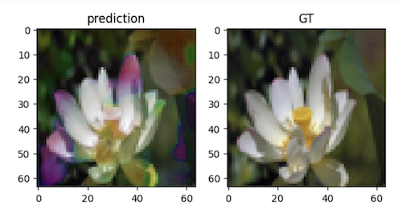

# UNet based image colorizer



## Training on vast.ai

Rent a 24GB 4090 instance. Then in local shell:

```
$ scp -P <port> *.* root@<ip addr>:~
```

Then in vast.ai's shell:

```
$ pip install -r requirements.txt
$ python3 generate_split.py
$ wandb login
$ python3 train.py
```